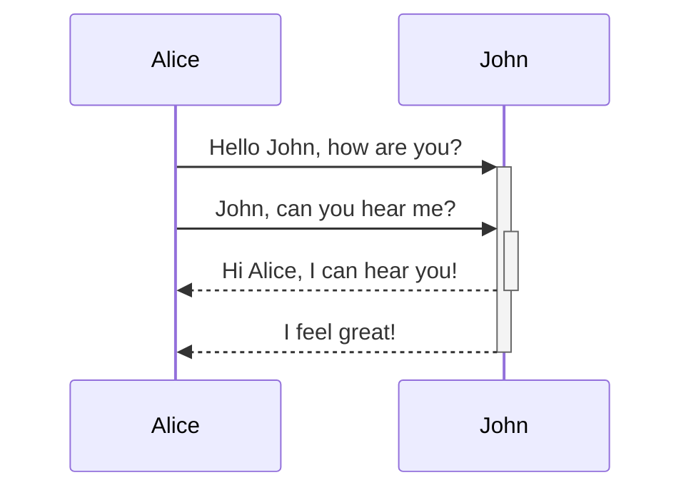
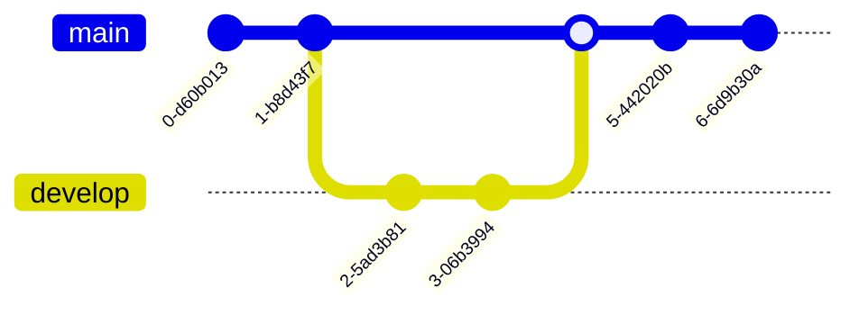

+++
title = "Mermaid"
description = ""
weight = 13
+++


```md
---
theme: beige
highlightTheme: css/vs2015.css

---




```md
---
theme: beige
highlightTheme: css/vs2015.css
---

#### Gitgraph Diagrams support


